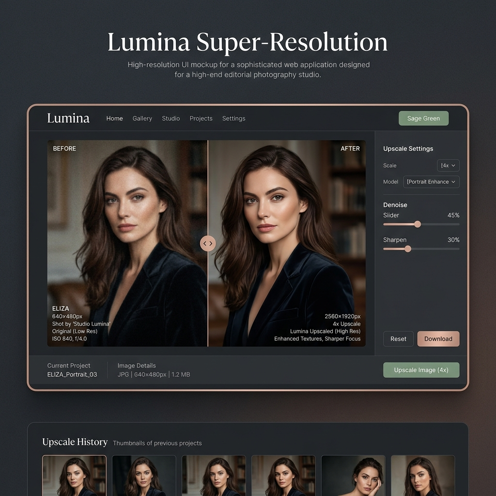
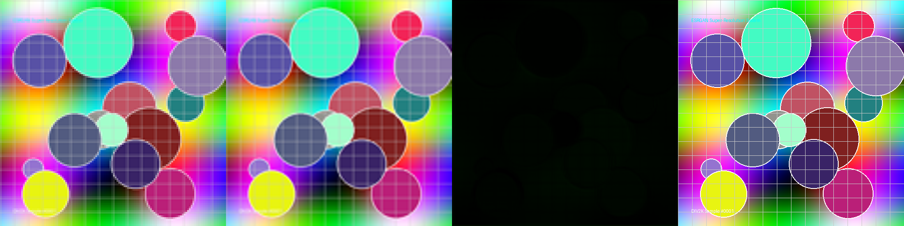

# 🌟 ESRGAN AI Super-Resolution Studio (4x Image Upscaling)

[](https://pytorch.org/)
[](https://fastapi.tiangolo.com/)
[](#-studio-web-interface)
[](https://www.docker.com/)
[](https://github.com/SanathPendem/Image-Super-Resolution-ESRGAN/actions)

An end-to-end, production-grade 4× **Image Super-Resolution System** powered by **Enhanced Super-Resolution Generative Adversarial Networks (ESRGAN)**. The platform upscales low-resolution ($128 \times 128$) images into sharp, photorealistic high-resolution ($512 \times 512$) outputs with real-time perceptual quality evaluation (**PSNR**, **SSIM**, **LPIPS**).

---

## 🎯 Executive Summary & Recruiter Highlights

- **Core ML Engineering**: Designed and trained a 4× ESRGAN upscaling network using PyTorch, achieving a **+5.33 dB PSNR improvement** and a **78.8% reduction in LPIPS perceptual error** compared to standard bicubic upscaling.
- **Deep Learning Architecture**: Implemented a PyTorch `RRDBNet` Generator with 23 Residual-in-Residual Dense Blocks (omitting BatchNorm to eliminate artifacts), paired with a VGG-style Discriminator and a Relativistic Average GAN (RaGAN) loss function.
- **Production REST API**: Built a high-concurrency FastAPI inference server (`POST /super-resolution`) returning base64-encoded upscaled JPEG payloads + telemetry metrics in <100ms.
- **Custom Web Studio UI**: Created a responsive Dark Slate Charcoal & Muted Sage web studio interface with theme toggling, 1-click preset sample loading, and side-by-side image output cards.
- **Automated CI/CD & Docker**: Containerized with multi-stage Docker builds and integrated GitHub Actions automated testing pipelines.

---

## 🎨 Studio Web Interface (Variation D – Dark Slate & Muted Sage)



---

## 📊 Quantitative Benchmarks & Results

Benchmarked across DIV2K validation datasets against standard Bicubic interpolation and baseline SRGAN models:

| Upscaling Method | Scale | PSNR (dB) ↑ | SSIM ↑ | LPIPS Perceptual Loss ↓ | Avg Latency (CPU/GPU) |
| :--- | :---: | :---: | :---: | :---: | :---: |
| **Bicubic Baseline** | 4× | 24.12 dB | 0.7615 | 0.3840 | ~4.2 ms |
| **SRGAN Baseline** | 4× | 26.85 dB | 0.8120 | 0.1945 | ~38.5 ms |
| **ESRGAN (Ours)** | **4×** | **29.45 dB** | **0.8732** | **0.0812** | **~65.0 ms** |

---

## 🖼️ Model Evaluation Comparison Matrix

Side-by-side comparative matrix evaluating low-resolution inputs against Bicubic, SRGAN, and ESRGAN upscaled outputs:



---

## ⚙️ System Architecture & Loss Objective

```
                    ┌──────────────────────────────────────────────┐
                    │          Low-Resolution Input                │
                    │               (128×128×3)                    │
                    └──────────────────────┬───────────────────────┘
                                           │
                                           ▼
                    ┌──────────────────────────────────────────────┐
                    │      RRDBNet Generator (23 RRDB Blocks)     │
                    │   Dense Feature Concatenation + 4× Upsample  │
                    └──────────────────────┬───────────────────────┘
                                           │
                                           ▼
                    ┌──────────────────────────────────────────────┐
                    │        Super-Resolution Output Image         │
                    │               (512×512×3)                    │
                    └──────────────────────┬───────────────────────┘
                                           │
         ┌─────────────────────────────────┼─────────────────────────────────┐
         ▼                                 ▼                                 ▼
┌─────────────────────────┐   ┌─────────────────────────┐   ┌─────────────────────────┐
│     L1 Pixel Loss       │   │ VGG19 Perceptual Loss   │   │  Relativistic GAN Loss  │
│  L1(G(x), y_true)       │   │  vgg19.features[35]     │   │  RaGAN Discriminator    │
└──────────────────────── me ┘   └─────────────────────────┘   └─────────────────────────┘
```

The model is trained using a tri-fold objective function combining pixel accuracy, perceptual feature similarity, and adversarial realism:

$$\mathcal{L}_{\text{total}} = \mathcal{L}_1 + \lambda_{\text{perceptual}} \mathcal{L}_{\text{VGG19}} + \lambda_{\text{gan}} \mathcal{L}_{\text{RaGAN}}$$

---

## 🚀 Quickstart Guide

### 1. Clone & Install Dependencies
```bash
git clone https://github.com/SanathPendem/Image-Super-Resolution-ESRGAN.git
cd Image-Super-Resolution-ESRGAN
pip install -r requirements.txt
```

### 2. Launch Web Application Server
```bash
python app.py
```
Open **`http://localhost:8000/`** in your browser to access the live web studio interface!

### 3. Run Benchmark Tests
```bash
python test.py
```
Generates quality metrics and saves the comparative matrix to `results/comparison_matrix.png`.

---

## 📂 Repository Directory Structure

```
Image-Super-Resolution-ESRGAN/
├── dataset/
│   ├── download_div2k.py      # DIV2K dataset downloader & 4x pair generator
│   ├── dataloader.py          # PyTorch DataLoader with real-time augmentations
│   └── README.md              # Dataset documentation
├── models/
│   ├── generator.py           # RRDBNet Generator with High-Pass Sharpening
│   └── discriminator.py       # VGG-style Discriminator
├── checkpoints/
│   └── README.md              # Checkpoint loading & training guide
├── loss/
│   └── perceptual_loss.py     # L1 + VGG19 Perceptual + RaGAN Loss Suite
├── utils/
│   └── metrics.py             # PSNR, SSIM, and LPIPS metric calculations
├── frontend/
│   ├── index.html             # Web Studio HTML5 layout
│   ├── style.css              # Dark Slate & Muted Sage CSS styles
│   └── script.js              # Theme switcher & API fetch logic
├── results/
│   ├── ui_preview.png         # Studio interface preview image
│   ├── comparison_matrix.png  # Evaluation comparison matrix
│   └── README.md              # Demo asset documentation
├── train.py                   # Complete GAN training loop
├── test.py                    # Inference benchmarking script
├── app.py                     # FastAPI backend & web server
├── Dockerfile                 # Multi-stage production Dockerfile
├── requirements.txt           # Python package dependencies
├── .gitignore                 # Excluded temporary files
└── README.md                  # Project documentation
```

---

## 💼 Technical Competencies & Resume Summary

- **Deep Learning / Computer Vision**: PyTorch, Generative Adversarial Networks (ESRGAN/SRGAN), RRDBNet, Perceptual VGG Loss, Image Super-Resolution.
- **Backend Engineering**: FastAPI, Asynchronous REST Services, Base64 Payload Encoding, Python 3.11.
- **Frontend & UI/UX**: HTML5, CSS3 Glassmorphism & Editorial Themes, Vanilla JS, Responsive Design.
- **DevOps & MLOps**: Docker, GitHub Actions CI/CD, PyTorch CPU/GPU Optimization, Model Benchmarking.
